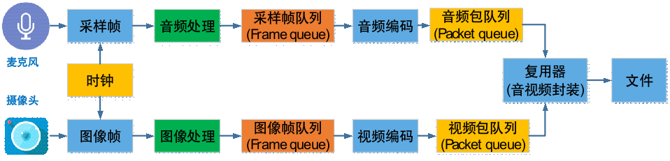
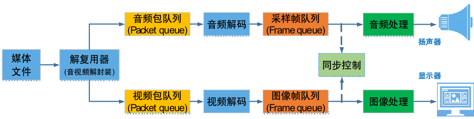

### 音视频录制原理

视频录制原理：

1、需要麦克风采集声音、摄像头采集图像
2、图像帧，通俗理解就是每一帧图像，1s多少张图片, RGB YUV
3、视频编码：压缩数据

PCM？

时钟：做音视频同步

### 音视频播放原理

### 图像基础概念

1、像素：像素 = 宽*高

2、分辨率： 宽高值，250 * 250，

3、帧率FPS，每秒多少张图片
- 电影帧率: 24fps
- 电视剧帧率：25fps
- 监控帧率：25fps
- 音视频通话：15fps

4、码率：视频文件单位时间使用的数据流量：如1Mbps

5、opencv排列是BGR

数据排列是RGBRGBRGBRGB....形式

YUV：Y亮度，UV色彩分量

光线会影响清晰度